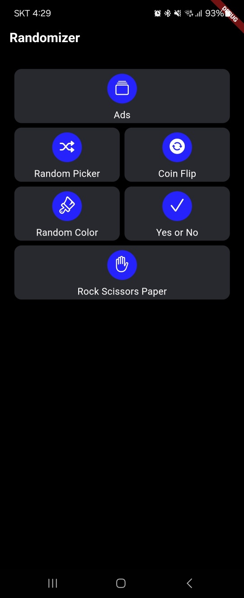

# 랜덤 게임 Flutter 앱

Flutter 기반의 랜덤 게임 애플리케이션으로, 다양한 랜덤화 도구와 미니 게임들을 제공합니다. 코인 뒤집기, 랜덤 색상 생성, 랜덤 매칭, 가위바위보 등의 기능을 포함하고 있습니다.

## 주요 기능

- **코인 뒤집기**: 가상의 동전을 뒤집어 랜덤 결과를 확인할 수 있습니다.
- **랜덤 색상 생성**: 무작위 색상과 해당 색상의 HEX 코드를 생성합니다.
- **랜덤 매칭**: 플레이어와 작업(Task)을 무작위로 매칭합니다.
- **가위바위보**: 랜덤으로 가위, 바위, 보 중 하나를 선택하여 결과를 확인합니다.
- **재사용 가능한 UI 컴포넌트**: 일관된 디자인을 유지하기 위해 재사용 가능한 버튼, 카드, 컨테이너 컴포넌트를 사용합니다.

## 스크린샷




## 설치 방법

1. 이 저장소를 클론합니다:

   ```bash
   git clone https://github.com/LuckyPlace/RandomGame.git
